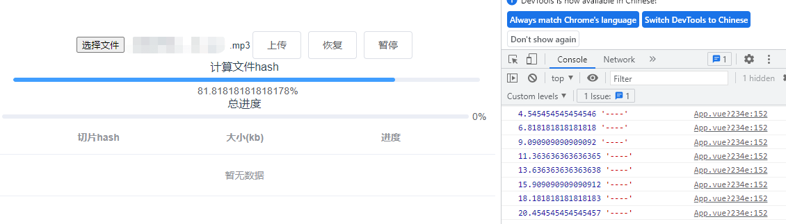

# Node+Vue 实现大文件上传，断点续传等

Vue 大文件上传和断点续传(帮忙点赞star谢谢，感谢♥)

[file-breakpoint-continue](https://github.com/webVueBlog/file-breakpoint-continue)

## 源代码

> 断点续传、分片上传、秒传、重试机制

文件上传是开发中的难点， 大文件上传及断点续传 难点中的细节及核心技术点。



element-ui 框架的上传组件，是默认基于文件流的。

1. 数据格式：form-data；
2. 传递的数据： file 文件流信息；filename 文件名字

通过 fileRead.readAsDataURL(file) 转为 base64 字符串后，
用 encodeURIComponent 编译再发送，发送的数据经由 qs.stringify 处理，
请求头添加 "Content-Type": "application/x-www-form-urlencoded"

es6文件对象、ajax 上传， async await promise 、后台文件存储、
流操作等全面的全栈技能的同时， 提升难度到大文件和断点续传。

移动时代图片成为社交的主流，短视屏时代铁定是大文件。

大文件  上传   8M   size 1M  8份

1. 前端上传大文件时使用 Blob.prototype.slice 将文件切片，并发上传多个切片，最后发送一个合并的请求通知服务端合并切片
2. 服务端接收切片并存储，收到合并请求后使用流将切片合并到最终文件
3. 原生 XMLHttpRequest 的 upload.onprogress 对切片上传进度的监听
4. 使用 Vue 计算属性根据每个切片的进度算出整个文件的上传进度
5. 使用 spark-md5 根据文件内容算出文件 hash
6. 通过 hash 可以判断服务端是否已经上传该文件，从而直接提示用户上传成功（秒传）
7. 通过 XMLHttpRequest 的 abort 方法暂停切片的上传
8. 上传前服务端返回已经上传的切片名，前端跳过这些切片的上传

## Blob.slice

Blob.slice() 方法用于创建一个包含源 Blob的指定字节范围内的数据的新 Blob 对象。

> 返回值

一个新的 Blob 对象，它包含了原始 Blob 对象的某一个段的数据。

## 切片 

1. js 在es6 文件对象file node file stream 有所增强。

任何文件都是二进制， 分割blob 

start,  size, offset  

http请求可并发  n个切片并发上传 速度更快， 改善了体验。

- 前端的切片，让http并发带来上传大文件的快感。

1. file.slice 完成切片， blob 类型文件切片， js 二进制文件类型的 blob协议 
2. 在文件上传到服务器之前就可以提前预览。 
  
- 服务器端

1. 如何将这些切片， 合交成一个， 并且能显示原来的图片
2. stream 流 
3. 可读流， 可写流
4. chunk 都是一个二进制流文件， 
5. Promise.all 来包装每个chunk 的写入
6. start end   fse.createWriteStream 
7. 每个chunk写入 先创建可读流，再pipe给可写流的过程 

思路： 以原文件做为文件夹的名字，在上传blobs到这个文件夹， 前且每个blob 都以文件-index的命名方式来存储

- http并发上传大文件切片 
- vue 实现上传文件的细节

无论是前端还是后端， 传输文件， 特别是大文件，有可能发生丢失文件的情况，网速， 服务器超时， 

> 如何避免丢失呢？ 

- hash，文件名 并不是唯一的， 不同名的图片 内容是一样， 针对文件内容进行hash 计算
- hash  前端算一个， 单向
- 后端拿到内容算hash 
- 一样， 
- 不一样 重传
- html5特性你怎么理解， localStorage ...

Web Workers  优化我们的前端性能， 将要花大量时间的， 复杂的，放到一个新的线程中去计算

文件上传通过hash 计算， 文件没有问题

- es6 哪些特性， 你怎么用的

函数参数赋默认值 

- 给用户快速感知， 用户体验是核心
- 并发http 前后端体验， 
- 断点续传

? 上传 
hash 
abort 
恢复

## 初始化文件内容

```js
yarn init -y

yarn add -g live-server

// web http方式
lastModified: 1644549553742
lastModifiedDate: Fri Feb 11 20xx 11:19:13 GMT+0800 (中国标准时间) {}
name: "banner.png"
size: 138424
type: "image/png"
webkitRelativePath: ""j
```

```js
yarn add multiparty
// 表单文件上传

$ vue --version
@vue/cli 4.5.13
vue create vue-upload-big-file

$ vue create vue-upload-big-file
? Please pick a preset: (Use arrow keys)
? Please pick a preset: Manually select features
? Check the features needed for your project: (Press <space> to select, <a> to t
? Check the features needed for your project: Choose Vue version, Babel
? Choose a version of Vue.js that you want to start the project with (Use arrow
? Choose a version of Vue.js that you want to start the project with 2.x
? Where do you prefer placing config for Babel, ESLint, etc.? (Use arrow keys)
> In dedicated config files
? Where do you prefer placing config for Babel, ESLint, etc.? In package.json
? Save this as a preset for future projects? (y/N) n

yarn add element-ui
```

在生成文件切片时，需要给每个切片一个标识作为hash，这里暂时使用 文件名+下标，这样后端可以知道当前切片是第几个切片，用于之后的合并切片

随后调用uploadChunks上传所有的文件切片，将文件切片，切片hash，以及文件名放入
formData中，再调用上一步的request函数返回一个promise，最后调用Promise.all并发上传所有的切片

hash，文件名，并不是唯一的.

不同名的图片，内容是一样。针对文件内容进行hash计算

hash 前端算一个，单向. 内容做hash计算

后端拿到内容算hash一样。不一样就要重传。

web workers 优化我们的前端性能，将要花大量时间的，复杂的，放到一个新的线程中去计算，
文件上传通过hash去计算，文件没有问题。

```js
yarn add fs-extra
```

## FormData.append()

发送数据用到了 FormData

formData.append(name, value, filename)，其中 filename 为可选参数，是传给服务器的文件名称， 当一个 Blob 或 File 被作为第二个参数的时候， Blob 对象的默认文件名是 "blob"。 

## 大文件上传

1. 将大文件转换为二进制流的格式
2. 利用流可以切割的属性，将二进制流切割成多份
3. 组装和分割块同等数量的请求块，并行或串行的形式发出请求
4. 再给服务器端发出一个合并的信息

## 断点续传

1. 为每个文件切割块添加不同的标识, hash
2. 当上传成功后，记录上传成功的标识
3. 当我们暂停或者发送失败后，可以重新发送没有上传成功的切割文件

## 代码

```js
<input
  v-if="!changeDisabled"
  type="file"
  :multiple="multiple"
  class="select-file-input"
  :accept="accept"
  @change="handleFileChange"
/>
```

## 创建切片

```js
createFileChunk(file, size = chunkSize) {
const fileChunkList = [];
var count = 0;
while (count < file.size) {
  fileChunkList.push({
	file: file.slice(count, count + size)
  });
  count += size;
}
return fileChunkList;
}
```

并发及重试

```js
// 为控制请求并发的Demo
const sendRequest = (urls, max, callback) => {
  let finished = 0;
  const total = urls.length;
  const handler = () => {
    if (urls.length) {
      const url = urls.shift();
      fetch(url)
        .then(() => {
          finished++;
          handler();
        })
        .catch((err) => {
          throw Error(err);
        });
    }

    if (finished >= total) {
      callback();
    }
  };
  // for控制初始并发
  for (let i = 0; i < max; i++) {
    handler();
  }
};

const urls = Array.from({ length: 10 }, (v, k) => k);

const fetch = function (idx) {
  return new Promise((resolve) => {
    const timeout = parseInt(Math.random() * 1e4);
    console.log('----请求开始');
    setTimeout(() => {
      console.log('----请求结束');
      resolve(idx);
    }, timeout);
  });
};

const max = 4;

const callback = () => {
  console.log('所有请求执行完毕');
};

sendRequest(urls, max, callback);
```

worker处理，性能及速度都会有很大提升.

```js
// 生成文件 hash（web-worker）
calculateHash(fileChunkList) {
  return new Promise(resolve => {
    this.container.worker = new Worker('./hash.js');
    this.container.worker.postMessage({ fileChunkList });
    this.container.worker.onmessage = e => {
      const { percentage, hash } = e.data;
      if (this.tempFilesArr[fileIndex]) {
        this.tempFilesArr[fileIndex].hashProgress = Number(
          percentage.toFixed(0)
        );
      }

      if (hash) {
        resolve(hash);
      }
    };
  });
}
```

文件的合并

```js
mergeRequest(data) {
   const obj = {
     md5: data.fileHash,
     fileName: data.name,
     fileChunkNum: data.chunkList.length
   };

   instance.post('fileChunk/merge', obj, 
     {
       timeout: 0
     })
     .then((res) => {
       this.$message.success('上传成功');
     });
 }
```

## 源码

```js
methods: {
 handleFileChange(e) {
  const [file] = e.target.files;
  if (!file) return;
  Object.assign(this.$data, this.$options.data());
  this.container.file = file;
},
async handleUpload() {}
}
```

XMLHttpRequest封装：

```js
request({
  url,
  method = "post",
  data,
  headers = {},
  requestList
}) {
  return new Promise(resolve => {
	const xhr = new XMLHttpRequest();
	xhr.open(method, url);
	Object.keys(headers).forEach(key =>
	  xhr.setRequestHeader(key, headers[key])
	);
	xhr.send(data);
	xhr.onload = e => {
	  resolve({
		data: e.target.response
	  });
	};
  });
}
```

上传切片

1. 对文件进行切片
2. 将切片传输给服务端

```js
const SIZE = 10 * 1024 * 1024; // 切片大小

data: () => ({
	container: {
	  file: null
	}，
	data: []
}),

handleFileChange() {},
// 生成文件切片
createFileChunk(file, size = SIZE) {
	const fileChunkList = [];
	let cur = 0;
	while(cur < file.size) {
		fileChunkList.push({ file: file.slice(cur, cur + size) });
		cur += size;
	}
	return fileChunkList;
},
// 上传切片
async uploadChunks() {
	const requestList = this.data
	 .map(({ chunk, hash }) => {
		 const formData = new FormData();
		 formData.append("chunk", chunk);
		 formData.append("hash", hash);
		 formData.append("filename", this.container.file.name);
		 return { formData };
	 })
	 .map(async ({ formData }) =>
		this.request({
			url: "http://localhost: 3000",
			data: formData
		})
	 );
	 await Promise.all(requestList); // 并发切片
},
async handleUpload() {
	if (!this.container.file) return;
	const fileChunkList = this.createFileChunk(this.container.file);
	this.data = fileChunkList.map(({file}, index) => ({
		chunk: file,
		hash: this.container.file.name + '-' + index // 文件名 + 数组下标
	}));
	await this.uploadChunks();
}
```

发送合并请求

```js
await Promise.all(requestList);

async mergeRequest() {
	await this.reques({
		url: "http://localhost:3000/merge",
		headers: {
			"content-type": "application/json""
		},
		data: JSON.stringify({
			filename: this.container.file.name
		})
	});
},
async handleUpload() {}
```

http模块搭建服务器：

```js
const http = require("http");
const server = http.createServer();

server.on("request", async (req, res) => {
  res.setHeader("Access-Control-Allow-Origin", "*");
  res.setHeader("Access-Control-Allow-Headers", "*");
  if (req.method === "OPTIONS") {
    res.status = 200;
    res.end();
    return;
  }
});

server.listen(3000, () => console.log("正在监听 3000 端口"));
```

使用 multiparty 包处理前端传来的 FormData

在 multiparty.parse 的回调中，
files 参数保存了 FormData 中文件，
fields 参数保存了 FormData 中非文件的字段

```js
const UPLOAD_DIR = path.resolve(__dirname, "..", "target"); // 大文件存储目录

const multipart = new multiparty.Form();
multipart.parse(req. async(err, fields, files) => {
	if (err) {
		return;
	}
	const [chunk] = files.chunk;
	const [hash] = fields.hash;
	const [filename] = fields.filename;
	const chunkDir = path.resolve(UPLOAD_DIR, filename);
	// 切片目录不存在，创建切片目录
	if (!fse.existsSync(chunkDir)) {
		await fse.mkdirs(chunkDir);
	}
	// fs-extra 专用方法，类似 fs.rename 并且跨平台
	// fs-extra 的 rename 方法 windows 平台会有权限问题
	await fse.move(chunk.path, `${chunkDir}/${hash}`);
	res.end("received file chunk");
});
```

合并切片

```js
// 在接收到前端发送的合并请求后，服务端将文件夹下的所有切片进行合并
const resolvePost = req =>
 new Promise(resolve => {
	 let chunk = "";
	 req.on("data", data => {
		 chunk += data;
	 });
	 req.on("end", () => {
		 resolve(JSON.parse(chunk));
	 });
 });
 
const pipeStream = (path, writeStream) =>
 new Promise(resolve => {
	 const readStream = fse.createReadStream(path);
	 readStream.on("end", () => {
		 fse.unlinkSync(path);
		 resolve();
	 });
	 readStream.pipe(writeStream);
 });

// 合并切片
const mergeFileChunk = async (filePath, filename, size) => {
	const chunkDir = path.resolve(UPLOAD_DIR, filename);
	const chunkPaths = await fse.readdir(chunkDir);
	// 根据切片下标进行排序
	// 否则直接读取目录的获取的顺序可能会错乱
	chunkPaths.sort((a,b)=>a.split("-")[1] - b.split("-")[1]);
	await Promise.all(
		chunkPaths.map((chunkPath, index) =>
			pipeStream(
				path.resolve(chunkDir, chunkPath),
				// 指定位置创建可写流
				fse.createWriteStream(filePath, {
					start: index * size,
					end: (index + 1) * size
				})
			)
		)
	);
	fse.rmdirSync(chunkDir); // 合并后删除保存切片的目录
}


if (req.url === '/merge') {
	const data = await resolvePost(req);
	const { filename, size } = data;
	const filePath = path.resolve(UPLOAD_DIR, `${filename}`);
	await mergeFileChunk(filePath, filename);
	res.end(
		JSON.stringify({
			code: 0,
			message: "file merged success"
		})
	)
}
```

使用 fs.createWriteStream 创建一个可写流，可写流文件名就是切片文件夹名 + 后缀名组合

将切片通过 fs.createReadStream 创建可读流，传输合并到目标文件中

> 生成hash

```js
// /public/hash.js
self.importScripts("/spark-md5.min.js"); // 导入脚本

// 生成文件 hash
self.onmessage = e => {
  const { fileChunkList } = e.data;
  const spark = new self.SparkMD5.ArrayBuffer();
  let percentage = 0;
  let count = 0;
  const loadNext = index => {
    const reader = new FileReader();
    reader.readAsArrayBuffer(fileChunkList[index].file);
    reader.onload = e => {
      count++;
      spark.append(e.target.result);
      if (count === fileChunkList.length) {
        self.postMessage({
          percentage: 100,
          hash: spark.end()
        });
        self.close();
      } else {
        percentage += 100 / fileChunkList.length;
        self.postMessage({
          percentage
        });
        // 递归计算下一个切片
        loadNext(count);
      }
    };
  };
  loadNext(0);
};
```

## worker 线程通讯的逻辑

```js
// 生成文件hash
calculateHash(fileChunkList) {
	return new Promise(resolve => {
		// worker属性
		this.container.worker = new Worker('/hash.js');
		this.container.worker.postMessage({ fileChunkList });
		this.container.worker.onmessage = e => {
			const { percentage, hash } = e.data;
			this.hashPercentage = percentage;
			if (hash) {
				resolve(hash);
			}
		}
	})
}
```

文件秒传

```js
async verifyUpload(filename, fileHash) {
	const { data } = await this.request({
		url: "http://localhost:3000/verify",
		headers: {
			"content-type": "application/json"
		},
		data: JSON.stringify({
			filename,
			fileHash
		})
	});
	return JSON.parse(data);
},
async handleUpload() {
	if (!this.container.file) return;
	const fileChunkList = this.createFileChunk(this.container.file);
	this.container.hash = await this.calculateHash(fileChunkList);
	const { shouldUpload } = await this.verifyUpload(
		this.container.file.name,
		this.container.hash
	);
	if(!shouldUpload) {
		this.$message.success("秒传：上传成功");
		return;
	}
	this.data = fileChunkList.map(({file}, index) => ({
		fileHash: this.container.hash,
		index,
		hash: this.container.hash + "-"  + index,
		chunk: file,
		percentage: 0
	}));
	await this.uploadChunks();
}
```

服务端：

```js
const extractExt = filename =>
	filename.slice(filename.lastIndexOf("."), filename.length); // 提取后缀名
```

暂停上传

```js
request({
	url,
	method = "post",
	data,
	headers = {},
	onProgress = e => e,
	requestList
}) {
	return new Promise(resolve => {
		const xhr = new XMLHttpRequest();
		xhr.upload.onprogress = onProgress;
		xhr.open(method, url);
		Object.keys(headers).forEach(key =>
			xhr.setRequestHeader(key, headers[key])
		);
		xhr.send(data);
		xhr.onload = e => {
			// requestList 中只保存正在上传切片的 xhr
			// 将请求成功的xhr从列表中删除
			if (requestList) {
				const xhrIndex = requestList.findIndex(item => item === xhr);
				requestList.splice(xhrIndex, 1);
			}
			resolve({
				data: e.targt.response
			});
		};
		// 暴露当前xhr给外部
		requestList?.push(xhr);
	})
}
```

暂停按钮

```js
 handlePause() {
    this.requestList.forEach(xhr => xhr?.abort());
    this.requestList = [];
}
```

前端每次上传前发送一个验证的请求，返回两种结果

1. 服务端已存在该文件，不需要再次上传
2. 服务端不存在该文件或者已上传部分文件切片，通知前端进行上传，并把已上传的文件切片返回给前端

服务端验证接口

```js
// 返回已经上传切片名列表
const createUploadedList = async fileHash =>
	fse.existsSync(path.resolve(UPLOAD_DIR, fileHash))
	 ? await fse.readdir(path.resolve(UPLOAD_DIR, fileHash))
	 : [];
	 
if (fse.existsSync(filePath)) {
      res.end(
        JSON.stringify({
          shouldUpload: false
        })
      )
    } else {
      res.end(
        JSON.stringify({
          shouldUpload: true,
          uploadedList: await createUploadedList(fileHash)
        })
      )
    }
```

1. 点击上传时，检查是否需要上传和已上传的切片
2. 点击暂停后的恢复上传，返回已上传的切片

```js
async handleResume() {
	this.status = Status.uploading;
	const { uploadedList } = await this.verifyUpload(
		this.container.file.name,
		this.container.hash
	)
	await this.uploadChunks(uploadedList)
},
```

## 断点续传

1. 服务器端返回，告知我从那开始
2. 浏览器端自行处理

> 缓存处理

1. 在切片上传的axios成功回调中，存储已上传成功的切片
2. 在切片上传前，先看下localstorage中是否存在已上传的切片,并修改uploaded
3. 构造切片数据时，过滤掉uploaded为true的

> 垃圾文件清理

1. 前端在localstorage设置缓存时间，超过时间就发送请求通知后端清理碎片文件，同时前端也要清理缓存。
2. 前后端都约定好，每个缓存从生成开始，只能存储12小时，12小时后自动清理

(时间差问题)

## 秒传

原理：计算整个文件的HASH，在执行上传操作前，向服务端发送请求，传递MD5值，后端进行文件检索。
若服务器中已存在该文件，便不进行后续的任何操作，上传也便直接结束。

> 在当前文件分片上传完毕并且请求合并接口完毕后，再进行下一次循环。
> 每次点击input时，清空数据。

Q: 处理暂停恢复后，进度条后退的问题

定义临时变量fakeUploadProgress在每次暂停时存储当前的进度，在上传恢复后，
当当前进度大于fakeUploadProgress的进度，再进行赋值即可。

ok!